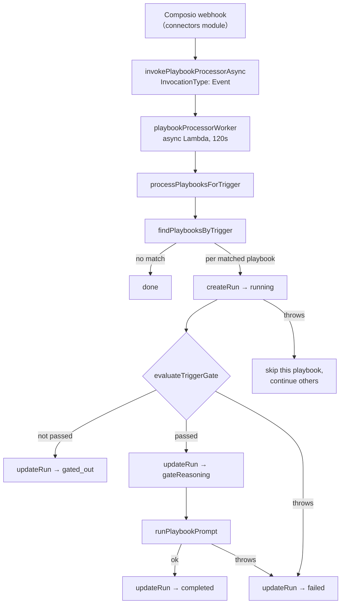
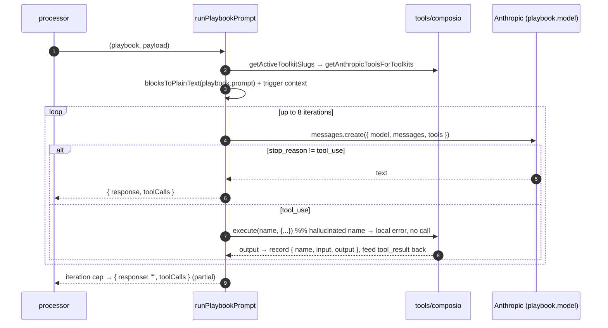
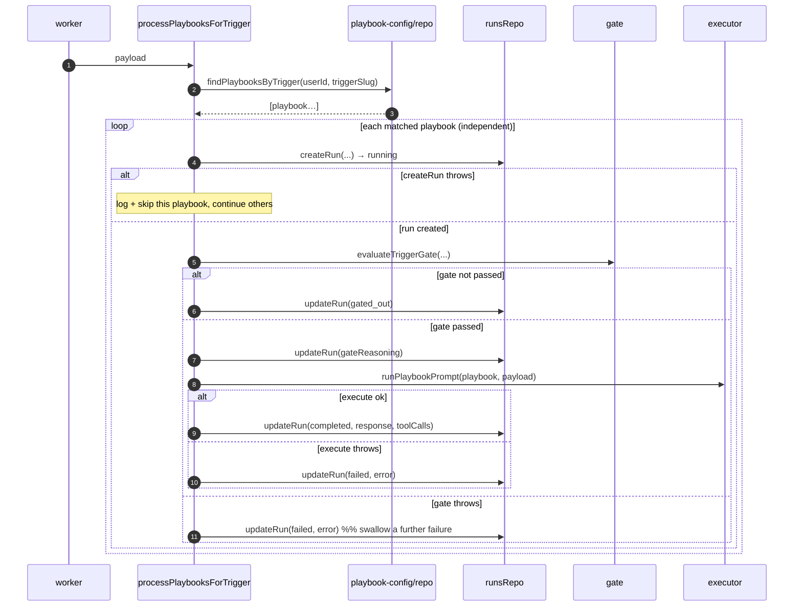

# Diagrams — Playbook Module

## Pipeline overview (webhook → run outcome)



## Gate — bounded investigative loop (sequence)

```mermaid
sequenceDiagram
    autonumber
    participant P as processor
    participant Gate as evaluateTriggerGate
    participant Tools as tools/composio
    participant Claude as Anthropic (Haiku)

    P->>Gate: (userId, triggerDescription, payload)
    alt description empty/whitespace
        Gate-->>P: { passed: true, reasoning: "…always matching." }
    else has description
        Gate->>Tools: getActiveToolkitSlugs → filter to payload.toolkitSlug
        Gate->>Tools: getAnthropicToolsForToolkits(...) + submit_gate_decision
        loop until decision or budget exhausted (max 4 real calls / 12 passes)
            Gate->>Claude: messages.create(tool_choice: any)
            alt submit_gate_decision
                Claude-->>Gate: { matches, reasoning }
                Gate-->>P: { passed: matches, reasoning }
            else investigative tool_use
                Gate->>Tools: execute(name, {userId, arguments})
                Note over Gate: hallucinated / not-found names answered locally,\nbudget NOT consumed; real results/errors consume it
                Tools-->>Gate: tool_result (fed back)
            end
        end
        Gate-->>P: fail closed: { passed: false, reasoning: "Could not confirm…" }
    end
```

## Executor — prompt tool-use loop (sequence)



## Processor — per-playbook swimlane


